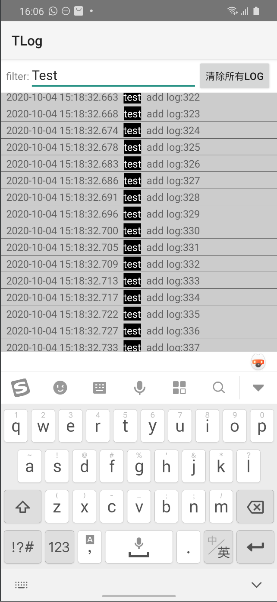

可以通过app本身看log的库。

# 使用方法：

添加依赖

```
implementation 'com.github.ironmanTony:tlog:v1.0.0'
```
> add jetpack:`maven { url 'https://jitpack.io' }`

init
```
TLog.config.openLog = BuildConfig.DEBUG
TLog.initTLog(this)
```
打log：
```
TLog.log("test", "this is a test")
```

打开log查看页面：
```
TLogActivity.start(requireContext())
```
如果自定义可以直接使用`TLogFragment`




